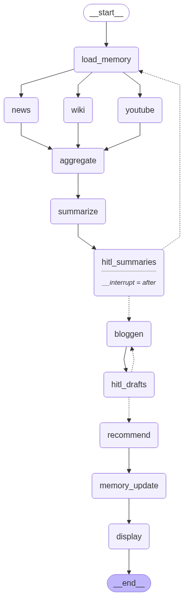

# 📝 Bloggen: Automated Content Assistant

**Automate the retrieval, aggregation, summarization, and generation of blog content from news sources using LangGraph, open-source LLMs, and LangSmith for traceability.**

---

## 📋 Overview

Bloggen orchestrates the end-to-end workflow for content creators:
- **Loads user memory** (session context/history)
- **Fetches news** (Tavily API)
- **Aggregates results**
- **Summarizes** with an LLM
- **Human-in-the-loop (HITL) review** of summaries
- **Generates a blog script** from accepted summaries
- **(Optional) Human review of blog drafts**
- **(Optional) Generates recommendations**
- **Updates memory** with the session's results
- **Displays final blogs and recommendations**

All major steps can be **traced and debugged** in LangSmith.

---

## 🗺️ Workflow



---

## 🛠️ Nodes

- **load_memory:** Loads user/session memory.
- **news:** Retrieves news articles using Tavily API.
- **aggregate:** Aggregates all source results.
- **summarize:** Summarizes results using an LLM (BART, etc).
- **hitl_summaries:** Human review/approval for generated summaries.
- **bloggen:** Generates blog script from accepted summaries (LLM).
- **hitl_drafts:** (Optional) Human review of generated blog drafts.
- **recommend:** (Optional) Recommends actions for content creators (LLM).
- **memory_update:** (Optional) Updates user/session memory.
- **display:** (Optional) Displays the final results.

---

## ⚡ How to Run

### 1. Clone and Install

```bash
git clone https://github.com/your-username/bloggen.git
cd bloggen
pip install -r requirements.txt
```

### 2. Set API Keys

Export your API keys as environment variables:

```bash
export LANGSMITH_API_KEY=your-langsmith-key
export TAVILY_API_KEY=your-tavily-key
```

### 3. Run

```bash
python your_file_name.py
```

---

## 🧩 Example Usage

**Sample input:**  
_User provides a topic or query (e.g., "what is trending in AI")._

**Sample output:**  
# ✨ Sample Bloggen Output: Trending in AI (2025)

## 🔗 Sources Used

- [Morgan Stanley: 5 AI Trends Shaping Innovation and ROI in 2025](https://www.morganstanley.com/insights/articles/ai-trends-reasoning-frontier-models-2025-tmt)
- [IBM: The Top Artificial Intelligence Trends](https://www.ibm.com/think/insights/artificial-intelligence-trends)
- [Google Cloud: 5 AI Trends in Public Sector](https://cloud.google.com/blog/topics/public-sector/5-ai-trends-shaping-the-future-of-the-public-sector-in-2025)
- [Microsoft: 6 AI Trends for 2025](https://news.microsoft.com/source/features/ai/6-ai-trends-youll-see-more-of-in-2025/)
- [AI News Portal](https://www.artificialintelligence-news.com/)

---

## 📝 Auto-Generated Blog Drafts

### 1️⃣ **5 AI Trends Shaping Innovation and ROI in 2025 | Morgan Stanley**
Recent advancements in AI are driving growth and reshaping business strategies. The focus is shifting from just faster coding to validating whether AI is delivering real business impact...  
[Read more](https://www.morganstanley.com/insights/articles/ai-trends-reasoning-frontier-models-2025-tmt)

---

### 2️⃣ **The Top Artificial Intelligence Trends - IBM**
Reasoning models and multimodal AI are the next big leap. Enterprises are investing in AI platforms like IBM Granite to scale and secure their AI workflows...  
[Read more](https://www.ibm.com/think/insights/artificial-intelligence-trends)

---

### 3️⃣ **5 AI Trends Shaping the Future of Public Sector in 2025 | Google Cloud**
AI is transforming public services, improving decision-making, and integrating multiple data sources for smarter infrastructure planning...  
[Read more](https://cloud.google.com/blog/topics/public-sector/5-ai-trends-shaping-the-future-of-the-public-sector-in-2025)

---

### 4️⃣ **6 AI trends you'll see more of in 2025 - Microsoft News**
Organizations are moving from AI experiments to full adoption, with secure and ethical AI use being a major focus...  
[Read more](https://news.microsoft.com/source/features/ai/6-ai-trends-youll-see-more-of-in-2025/)

---

### 5️⃣ **AI News | Latest AI News, Analysis & Events**
AI continues to disrupt industries, from finance to healthcare, with emerging applications and evolving regulatory trends...  
[Read more](https://www.artificialintelligence-news.com/)

---

## 🟢 Ready for Human Review

You can now review, edit, and publish these auto-generated blog sections.  
_Long sections are automatically capped for easy reading—click through for more!_

---

## 📚 Notes
# *ACTIVELY PURSUING IMPROVEMENTS*
- The workflow is designed for extensibility: you can add YouTube/Wiki retrievers, HITL steps, or integrate more LLMs.
- HITL (human-in-the-loop) steps can be CLI prompts or Streamlit components.

---

